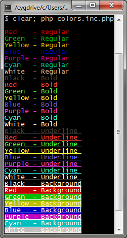

PHP-CLI Colors
==============

If you use PHP for anything command-line related, you've probably wanted colors at some point.
Now you can!  The easy way!

This handy include files contains a miriad of color defines, along with some sample functions to make colorizing text easy.


Usage
-----

    include_once('colors.inc.php');
    echo CLEAR;
    echo TXTRED . "Hello Red World!" . TXTRST . PHP_EOL;
    echo green("Hello Green World!") . PHP_EOL;
    
For a full list of colors, consult the include file itself.
To sample the colors, change ```FALSE``` to ```TRUE``` in the include and run it standalone.


Notes
-----

Using colorized text inside of ```printf``` calls is not recommended.  (string length !== visible length)
Using colorized text inside of files is not recommended.
On some setups, the colors may appear somewhat differently.  This is most notable with the bold vs regular colorsets.
If the colored text fails to render, it's not you.  It's your console.

Works and tested with PuTTY and Cygwin.


